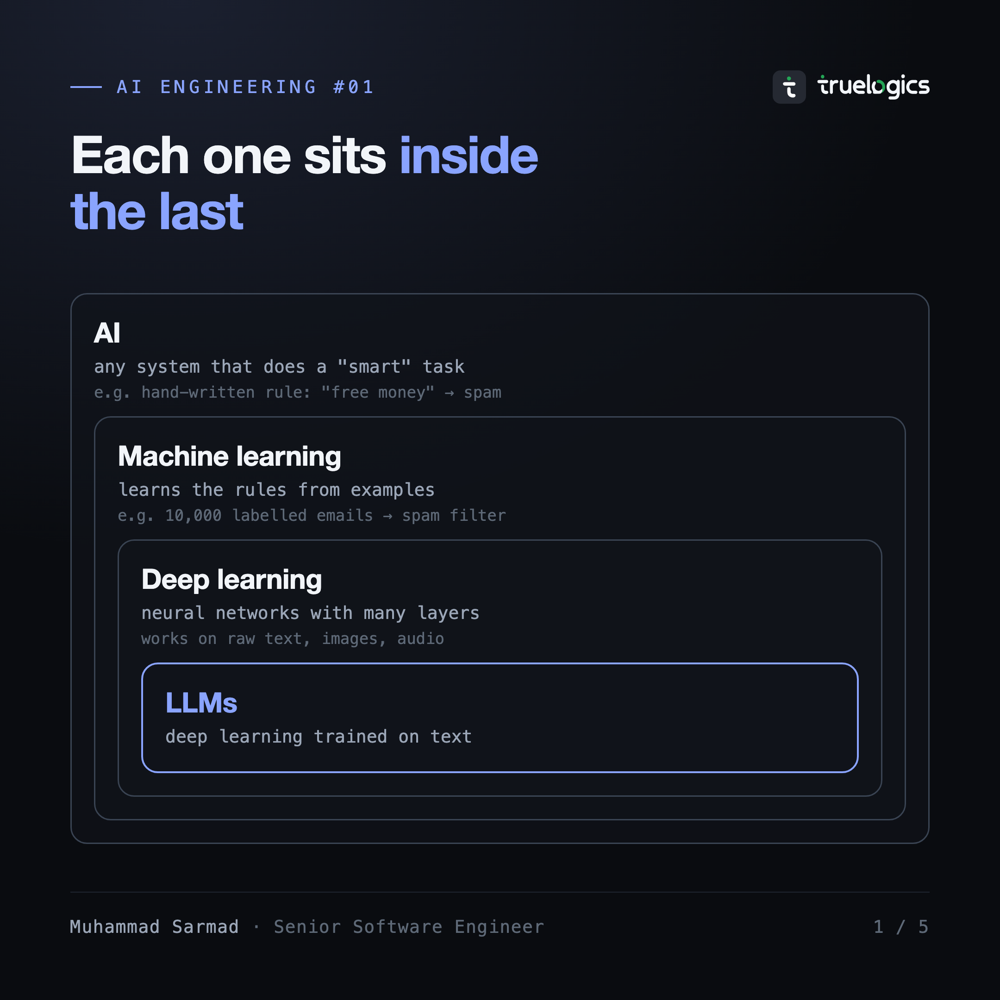
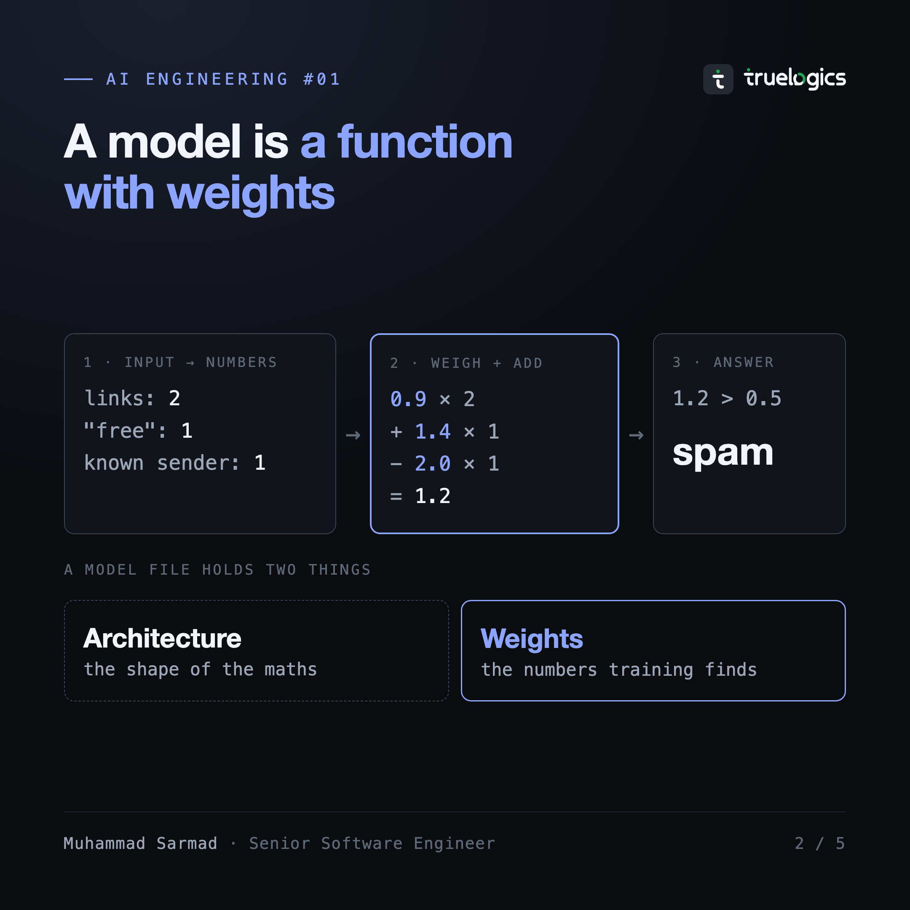
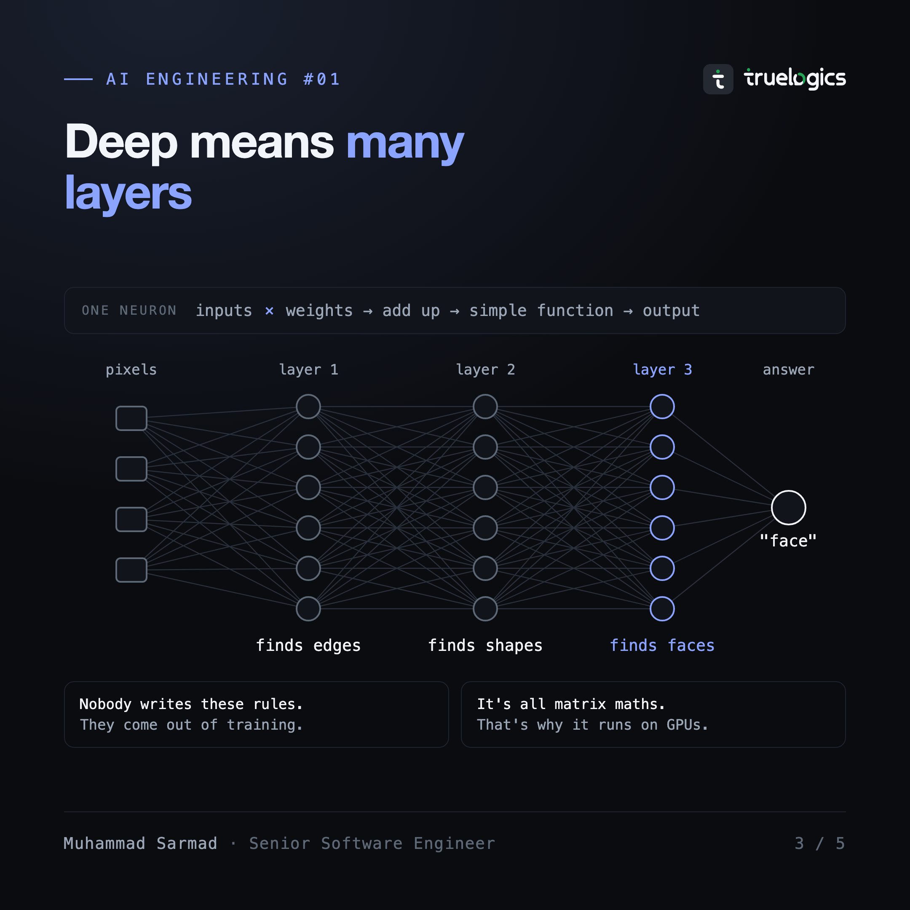
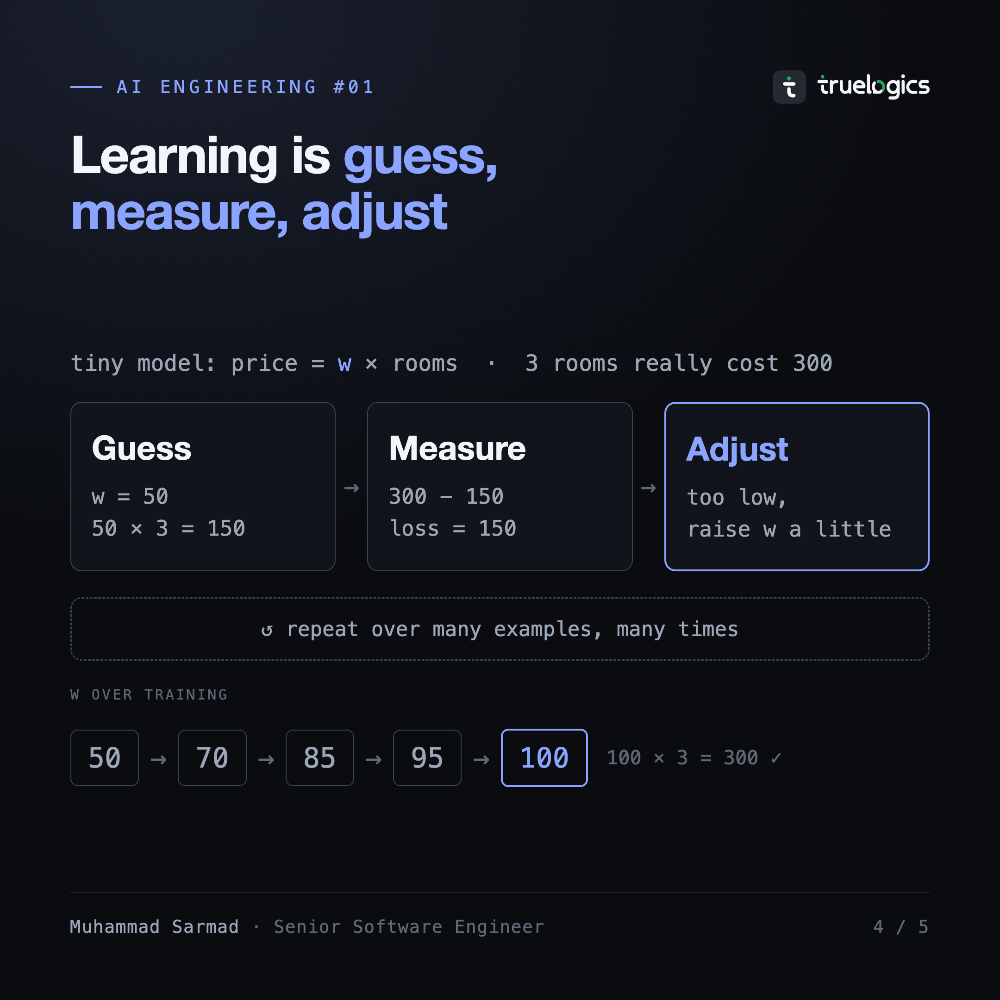
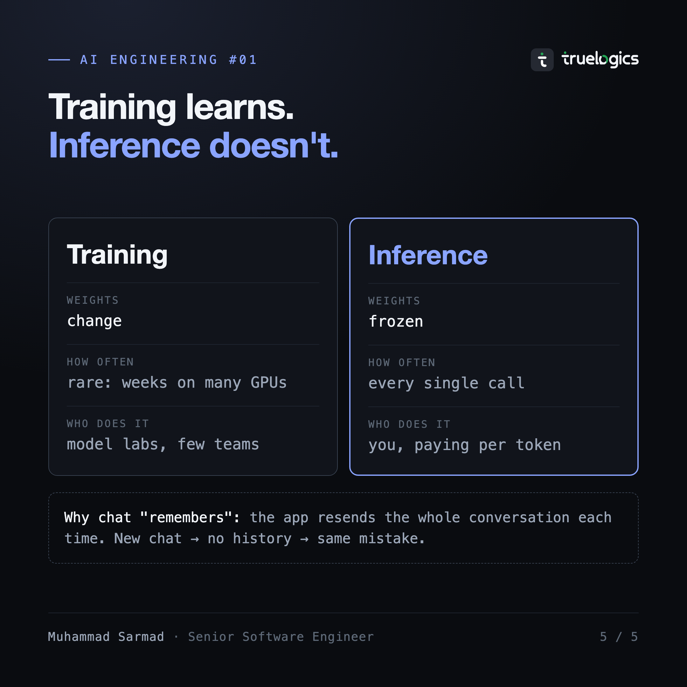

You correct a chat model. Tomorrow, in a new chat, it makes the same mistake. It did not forget. It never learned.

Five simple ideas explain why.

## 1. AI vs ML vs deep learning

- **AI:** any system that does a "smart" task. It can be a hand-written rule: if the email says "free money", mark it as spam.
- **Machine learning:** the system learns the rules from examples. Show it 10,000 labelled emails and it works out what spam looks like.
- **Deep learning:** machine learning with neural networks of many layers. LLMs are deep learning trained on text.

Each one sits inside the one before it.

## 2. What a model is

A model is a **function with learned numbers inside it**. For a spam filter:

1. The email becomes numbers: 2 links, the word "free" once, a known sender.
2. Each number is multiplied by a **weight** and added up: 0.9 × 2 + 1.4 × 1 − 2.0 × 1 = 1.2.
3. Above 0.5 means spam. 1.2 is spam.

Nobody typed those weights in. Training found them.

So a model file holds two things: the **architecture** (the shape of the maths) and the **weights** (the numbers training found). Same architecture, different weights, different model.

## 3. Neural networks

A **neuron** does the same thing: multiply inputs by weights and add them up. A **layer** is many neurons side by side. "Deep" just means many layers stacked.

In an image model, early layers find edges, later ones find shapes, then faces. Nobody writes those rules; they come out of training. It's all multiplication, which is why AI runs on GPUs.

## 4. How a model learns

Training is a loop. Take a tiny model: price = w × rooms. A 3-room house sold for 300.

1. **Guess:** w = 50, so the model says 150.
2. **Measure:** it's off by 150. This error is called the **loss**.
3. **Adjust:** too low, so raise w a little.
4. **Repeat** until w = 100 and the answer is 300.

Big models do the same thing with billions of weights.

One trap: a model can **memorise** its examples instead of learning. It scores well on data it has seen and badly on new data. So always test it on data it never trained on.

## 5. Training vs inference

- **Training** changes the weights. It's slow and expensive, and mostly done by model labs.
- **Inference** uses the weights, frozen. It runs on every API call, and you pay per **token** (a small piece of text, about a word).

So your correction never changed the model. A chat only seems to remember because the app sends the whole conversation again with every message. New chat, no history, same mistake.

**Fine-tuning** is extra training on an already-trained model, using your own examples. It gives you a new version of the model. It helps with a fixed style or format, but most apps don't need it: a good prompt with the right facts in it is cheaper and easier to change.

## Try it on Optimal Lab

- [The context window](https://optimallab.dev/tracks/ai/context-window): watch a chat resend every message as it grows.
- [How text becomes tokens](https://optimallab.dev/tracks/ai/tokenization): type your own text and count the tokens.
- [How an LLM picks the next token](https://optimallab.dev/tracks/ai/next-token): one inference step, with temperature you can drag.

There's no interactive for training yet.

## Keep in mind

- The model won't learn from your chats. Send what it needs on every call.
- New facts go in the prompt, not the weights.
- Long chats cost more, because every message is sent again.

## Next in the series

What an LLM actually does at inference. Next-token prediction, plainly.
